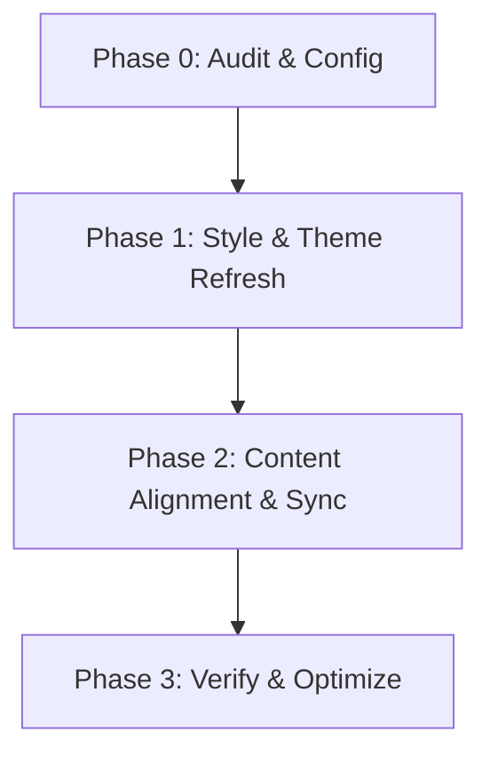

# Site Refresh Master Plan

## Context / Source
This document outlines the master implementation plan for refreshing `RyotaroOKabe.github.io` into a modern, elegant academic portfolio.

---

## Proposed Work plan

### Phase 0: Repository Audit & Configuration Setup (Completed)
- [x] Inspect directory architecture and build dependencies.
- [x] Extract profile/CV details from the new CV PDF.
- [x] Identify mismatches in publications and links.
- [x] Create planning documents (`docs/`) and `.claude/` files.
- [x] Switch to `refresh/site-redesign` branch.

### Phase 1: CSS & Visual System Redesign (Awaiting Review)
- **CSS Variable Foundations**: Introduce a new design token system in a custom Sass partial `_sass/_tokens.scss` defining light/dark colors, spacing, and typography.
- **Theme Support**: Implement CSS media queries for `prefers-color-scheme` to support light/dark modes automatically. Include a manual toggle button in the header.
- **Layout Simplification**:
  - Replace the cluttered sidebar (`_includes/author-profile.html`) with a simpler layout (either single-column with profile header or a clean sidebar with less clutter).
  - Modernize the header menu and footer.
- **Typography Refresh**: Import *Inter* from Google Fonts and update typography styles in `_sass/_base.scss`.

### Phase 2: Content Alignment & Publication Sync
- **CV Alignment**:
  - Update `_pages/cv.md` to point to `files/2026-06-18_cv_RyotaroOKABE.pdf`.
- **Publication Database Sync**:
  - Add missing publications (e.g., Chotrattanapituk 2026, Landry 2026, Cheng 2026, Boonkird 2025) to `markdown_generator/publications.csv`.
  - Update venue information for *Tuning Chiral Anomaly Signature* to *Nano Letters*.
  - Run `markdown_generator/publications.py` to regenerate the publication markdown files.
- **Clean Metadata**: Update `_config.yml` and `_data/authors.yml` to remove dummy author placeholders.

### Phase 3: Verification & Local Testing
- Resolve Dropbox local building permission conflicts (by temporarily pausing Dropbox or testing in a separate non-synced folder).
- Verify responsive layout across mobile and desktop.
- Run lighthouse-equivalent audits on contrast ratio, typography sizes, and performance.
